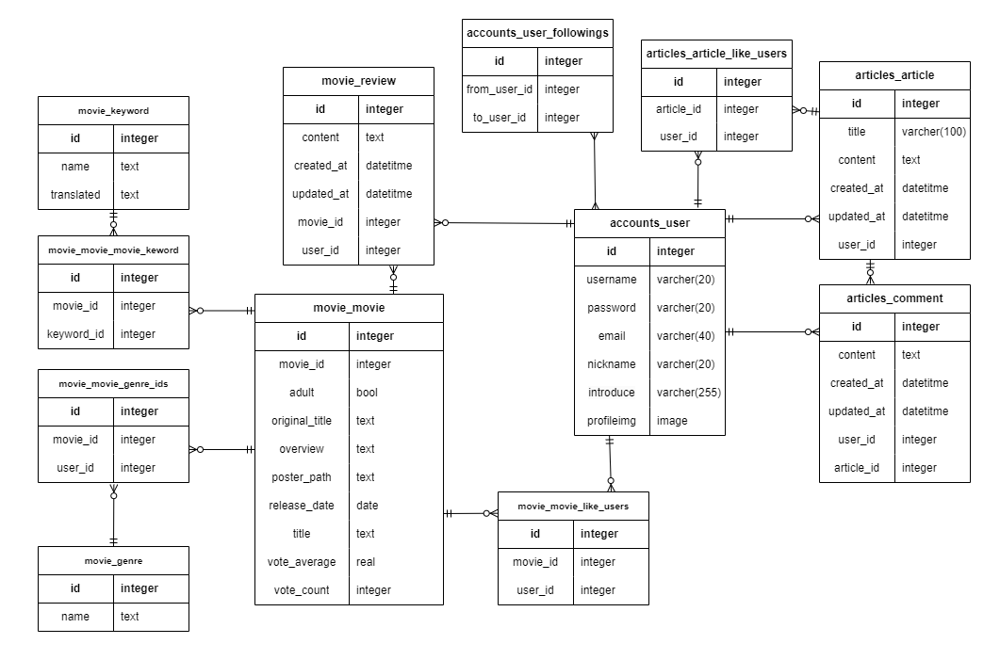
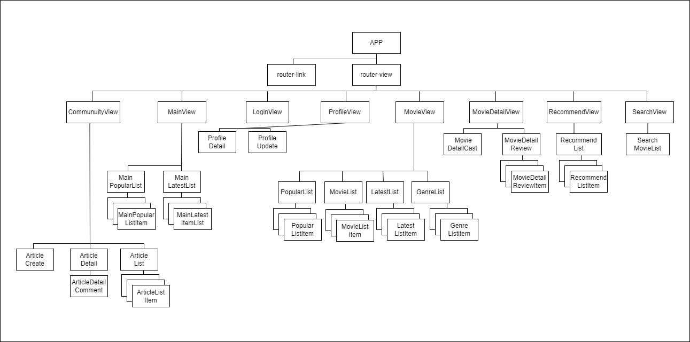
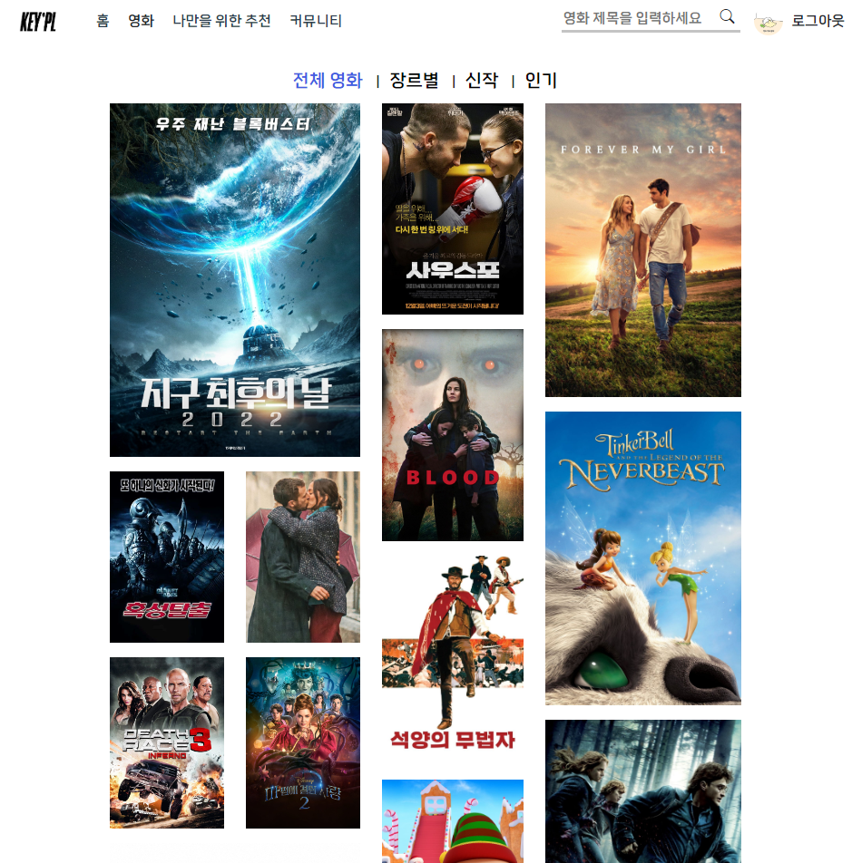
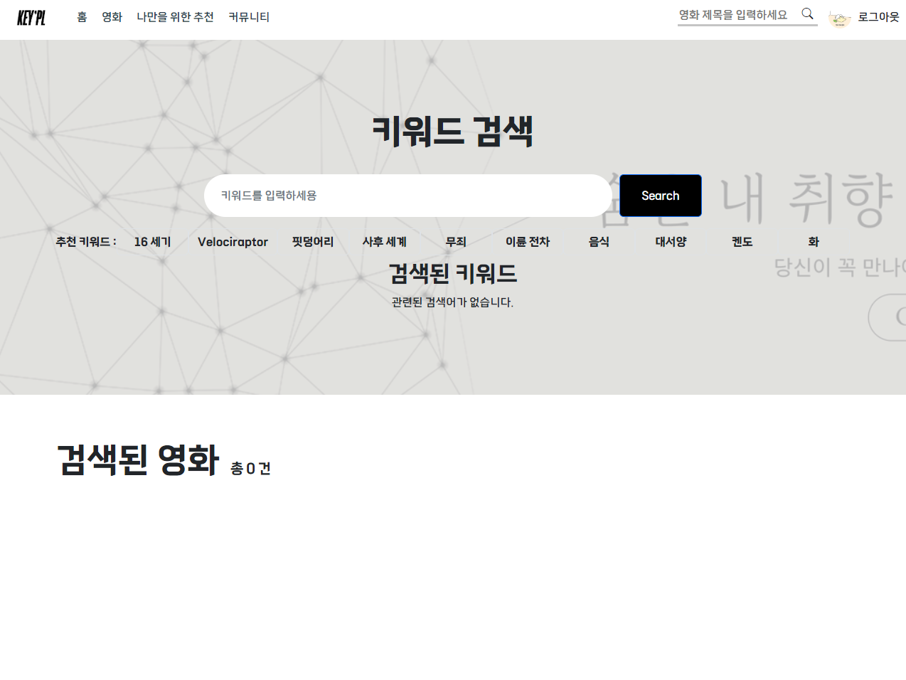
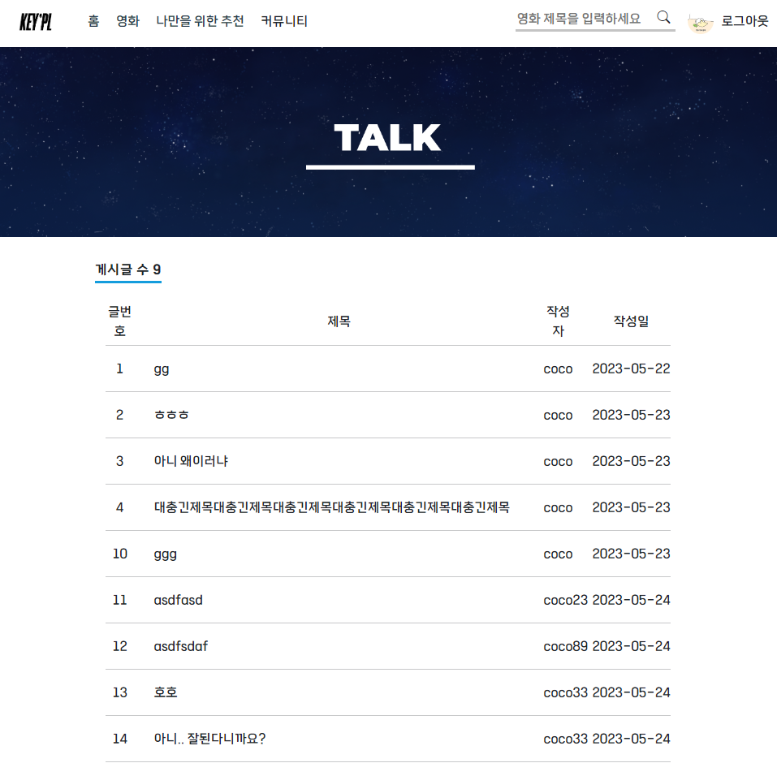
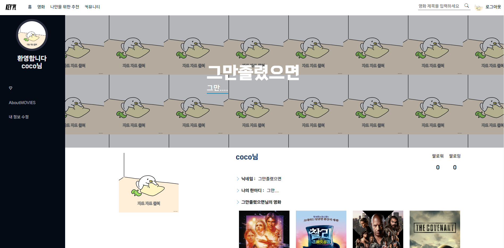
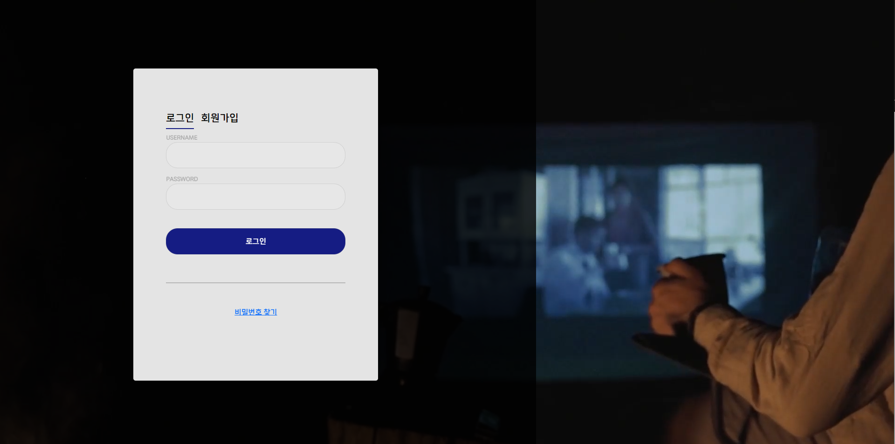

## 2023 관통 프로젝트

---

#### 🎬 프로젝트명 : KEYUP! PROJECT (2023.05.17 - 2023.05.25)


#### ⚙ 사용 툴

---

> 프론트 : Vue
> 
> 백 : Django
> 
> 환경 : Gitlab, Google Meet

 

#### 📢 프로젝트 소개

---

웹 사이트에서 가장 중요한 것은 유저의 니즈를 파악하는 것입니다.

유저의 니즈는 어디서 올까요?

유저가 관심 있는, 좋아하는 영화들의 공통점을 어떻게 파악할 수 있을까요?

이 모든 것은 '키워드'에서 시작합니다.

우리의 사이트는 이 키워드에 초점을 맞췄습니다.


#### 

---

팀장 : 이지혁

- Email Address : illu140411@gamil.com

팀원 : 오연주

- Email Address : siunaus224@gmail.com


#### 요구사항

---

##### Requirements

- Python 3.9.x

- Django 3.2.x

- Node.js 18.x

- Vue2


##### Installation

```bash
$ git clone https://lab.ssafy.com/yamcys/final_pjt.git
```


##### Backend

```bash
$ cd final-pjt-back
$ python -m venv venv
$ source venv/Scripts/active
$ pip install -r requirements.txt
```


##### Frontend

```bash
$ cd final-pjt-front
$ npm i
```


#### ERD

---



 

#### 컴포넌트 구조

---



#### 화면 구성

---

| 메인 페이지                                                                              | 영화 조회 페이지                                                                           |
| ----------------------------------------------------------------------------------- | ----------------------------------------------------------------------------------- |
|  |  |
| <b>추천 알고리즘 페이지</b>                                                                  | **커뮤니티 페이지**                                                                        |
|  |  |
| **마이페이지**                                                                           | **로그인/회원가입**                                                                        |
|  |  |

#### 주요 기능

---

##### ⭐ 영화 키워드별 추천 기능

- 검색어 관련 키워드 존재 시 키워드 추천 및 관련 영화 제공

- 추천 키워드 제공하여 빠른 서치 가능

##### ⭐ 랜덤/신작/인기순/장르별 영화 조회 기능

- 신작, 인기순, 장르별 탭 클릭 시 순위에 맞는 영화 조회 가능

- 전체 영화 조회 시 랜덤으로 조회되어 다양한 작품 접근 가능

- 영화 클릭 시 영화별 상세 페이지 제공, 좋아요, 영화별 코멘트 작성 가능

##### ⭐ 유저별 페이지, 팔로우 기능 제공

- 유저별 페이지에서 좋아요한 영화 조회 가능

- 마이 페이지일 경우 내 정보 수정, 다른 사람의 페이지일 경우 팔로우 기능 제공

##### ⭐ 커뮤니티 기능 제공

- 게시판 형태로 자유로운 글 작성과 댓글 가능
  
  

##### 영화 추천 알고리즘

---

1. DB 내부 영화에 대한 키워드 추출 작업

2. 파이썬 구글 번역 라이브 러리를 통한 번역 작업

3. 키워드 생성 후 DB 삽입 및 영화와 M-N 관계 형성

4. 키워드 리스트 중 10개 키워드 랜덤 추천 및 키워드 검색 기능

5. 키워드가 특정 단어를 포함시, 키워드 목록 생성

6. 특정 키워드 클릭 시 키워드를 포함한 영화 리스트 생성

7. 특정 영화 클릭시 상세 영화 페이지로 이동


##### 전체 일정

---

###### 프로젝트 개발 계획

| 분류    | 계획                         | 시작일    | 마감일    | 실 마감일  |
| ----- | -------------------------- | ------ | ------ | ------ |
| 기획    | ERD, 컴포넌트 구조               | 230517 | 230517 | 230517 |
| 백엔드   | 로그인, 로그아웃, 회원가입, 커뮤니티기능 구현 | 230517 | 230517 | 230517 |
| 기획    | 와이어프레임, Dumpdata생성         | 230518 | 230518 | 230519 |
| 백엔드   | 무비 앱 기능 구현                 | 230518 | 230518 | 230518 |
| 프론트엔드 | 메인, 무비 기능 구현               | 230518 | 230518 | 230518 |
| 프론트엔드 | 영화 관련 페이지 기능 구현 및 디자인      | 230519 | 230519 | 230523 |
| 프론트엔드 | 유저 페이지및 키워드 페이지 디자인        | 230520 | 230520 | 230523 |
| 프론트엔드 | 영화상세 및 커뮤니티 디자인            | 230521 | 230521 | 230524 |
| 전체    | 디자인 수정 및 기능 개선             | 230522 | 230524 | 230525 |

##### 

###### 팀원 정보 및 업무 분담 상세 내역

| 분류       | 기능            | 담당  | 시작일      | 마감일      | 실 마감일    |
|:-------- | ------------- | --- | -------- | -------- | -------- |
| 기획회의     | 큰 틀           | 모두  | 23-05-17 | 23-05-17 | 23-05-17 |
| 기획       | ERD           | 이지혁 | 23-05-17 | 23-05-17 | 23-05-17 |
|          | 컴포넌트구조        | 오연주 | 23-05-17 | 23-05-17 | 23-05-17 |
| 백엔드      | 회원가입          | 오연주 | 23-05-17 | 23-05-17 | 23-05-17 |
| accounts | 로그인           | 오연주 | 23-05-17 | 23-05-17 | 23-05-17 |
|          | 로그아웃          | 오연주 | 23-05-17 | 23-05-17 | 23-05-17 |
|          | 유저 정보조회       | 오연주 | 23-05-17 | 23-05-17 | 23-05-17 |
|          | 팔로우,팔로잉       | 오연주 | 23-05-17 | 23-05-17 | 23-05-17 |
| 게시글앱     | 게시글 조회,삭제,수정  | 이지혁 | 23-05-17 | 23-05-17 | 23-05-17 |
|          | 게시글 생성, 좋아요   | 이지혁 | 23-05-17 | 23-05-17 | 23-05-17 |
| 댓글       | 댓글 생성         | 이지혁 | 23-05-17 | 23-05-17 | 23-05-17 |
|          | 댓글 조회,삭제,수정   | 이지혁 | 23-05-17 | 23-05-17 | 23-05-17 |
| DATA     | Dumpdata 생성   | 오연주 | 23-05-18 | 23-05-18 | 23-05-18 |
| movie앱   | 리뷰 생성         | 이지혁 | 23-05-18 | 23-05-18 | 23-05-18 |
|          | 영화 좋아요        | 이지혁 | 23-05-18 | 23-05-18 | 23-05-18 |
|          | 무비, 리뷰 모델 생성  | 이지혁 | 23-05-18 | 23-05-18 | 23-05-18 |
| 디자인      | 와이어프레임        | 모두  | 23-05-18 | 23-05-18 | 23-05-19 |
| 프론트      | 메인페이지 기능 구현   | 오연주 | 23-05-18 | 23-05-18 | 23-05-18 |
| 프론트      | 무비페이지 기능 구현   | 이지혁 | 23-05-18 | 23-05-18 | 23-05-18 |
| 백        | movie, 좋아요 추가 | 이지혁 | 23-05-19 | 23-05-19 | 23-05-19 |
|          | 영화 추천 완료      | 이지혁 | 23-05-19 | 23-05-19 | 23-05-19 |
|          | 상세페이지 완료      | 오연주 | 23-05-19 | 23-05-19 | 23-05-19 |
|          | 검색버튼          | 오연주 | 23-05-19 | 23-05-19 | 23-05-19 |
|          | 게시글 댓글 수정 삭제  | 이지혁 | 23-05-19 | 23-05-19 | 23-05-19 |
|          | 게시글 댓글작성      | 오연주 | 23-05-20 | 23-05-20 | 23-05-20 |
|          | 마이페이지 완료      | 오연주 | 23-05-20 | 23-05-20 | 23-05-20 |
|          | 영화 제목 검색 기능   | 이지혁 | 23-05-20 | 23-05-20 | 23-05-20 |
| 프론트      | 메인 CSS 구현     | 오연주 | 23-05-19 | 23-05-19 | 23-05-21 |
|          | 마이페이지 CSS     | 오연주 | 23-05-20 | 23-05-20 | 23-05-23 |
|          | nav bar CSS   | 이지혁 | 23-05-20 | 23-05-20 | 23-05-21 |
|          | 영화 상세페이지 CSS  | 이지혁 | 23-05-22 | 23-05-21 | 23-05-22 |
|          | 프로필 CSS       | 오연주 | 23-05-22 | 23-05-20 | 23-05-22 |
|          | 커뮤니티 CSS      | 오연주 | 23-05-22 | 23-05-21 | 23-05-22 |
|          | 영화 전체 페이지 CSS | 이지혁 | 23-05-22 | 23-05-21 | 23-05-23 |
|          | 키워드 추천 CSS    | 이지혁 | 23-05-22 | 23-05-20 | 23-05-23 |
|          | 로그인, 회원가입 CSS | 오연주 | 23-05-22 | 23-05-21 | 23-05-23 |
| 백엔드      | 검색 관련 기능 구현   | 이지혁 | 23-05-23 | 23-05-19 | 23-05-23 |
| 프론트      | 영화 검색 페이지 CSS | 이지혁 | 23-05-23 | 23-05-21 | 23-05-24 |
|          | 영화 상세 리뷰 CSS  | 오연주 | 23-05-23 | 23-05-21 | 23-05-24 |
|          | 인기/신작 탭 CSS   | 이지혁 | 23-05-23 | 23-05-21 | 23-05-24 |
|          | 작은 오류 수정      | 모두  | 23-05-24 | 23-05-24 | 23-05-25 |

##### URL

---

##### 서버, 클라이언트 URL

| 서버 URL(http://127.0.0.1:8000)       | 역할                |
| ----------------------------------- | ----------------- |
| accounts/login/                     | 로그인               |
| accounts/logout/                    | 로그아웃              |
| accounts/signup/                    | 회원가입              |
| accounts/user/                      | 유저 정보 조회          |
| articles/                           | 게시글 목록 조회, 게시글 작성 |
| articles/\<int:article_pk>/         | 게시글 상세 조회, 삭제, 수정 |
| \<int:article_pk>/like/             | 게시글 좋아요           |
| articles/comments/                  | 댓글 목록 조회          |
| articles/\<int:comment_pk>/         | 댓글 상세 조회, 삭제, 수정  |
| \<int:article_pk>/comments/         | 댓글 생성             |
| movies/                             | 영화 목록 조회          |
| movies/\<int:movie_pk>/             | 영화 상세 조회          |
| movies/\<int:movie_pk>/like/        | 영화 좋아요            |
| movies/\<int:movie_pk>/reviews/     | 영화별 리뷰 조회         |
| movies/reviews/                     | 리뷰 목록 조회          |
| movies/reviews/\<int:review_pk>     | 리뷰 상세 조회, 수정, 삭제  |
| movies/keywords/                    | 키워드 조회, 삭제        |
| movies/keywords/\<int:keyword_pk>/  | 키워드별 영화 조회        |
| movies/genres/                      | 장르 전체 조회          |
| movies/keywords/\<str:keyword_str>/ | 번역 키워드 영화 조회      |

| 클라이언트 URL(http://localhost:8080) | 역할           |
| -------------------------------- | ------------ |
| /                                | 메인 페이지(홈)    |
| /movies/                         | 영화 조회 페이지    |
| /movies/all/                     | 영화 전체 조회(랜덤) |
| /movies/genre/                   | 장르별 영화 조회    |
| /movies/latest/                  | 최신 영화 조회     |
| /movies/popular/                 | 인기 영화 조회     |
| /moviedetail                     | 영화 상세 페이지    |
| /recommend/                      | 키워드별 추천 영화   |
| /profile/detail/:username        | 유저별 프로필 조회   |
| /profile/update                  | 유저 프로필 업데이트  |
| /login/                          | 로그인          |
| /signup/                         | 회원가입         |
| /community/create                | 커뮤니티 글 작성    |
| /community/list                  | 커뮤니티 전체 글 조회 |
| /article/:id                     | 커뮤니티 상세 글 조회 |

##### 목표 서비스 구현 및 실제 구현 정도

---

✔ 회원가입, 로그인

✔ 신작, 장르별, 인기순 영화 조회

✔ 영화 상세정보 조회

✔ 영화 출연 배우 출력

✔ 영화 코멘트 생성, 수정, 삭제

✔ 키워드 추천 알고리즘

✔ 커뮤니티 글 작성, 수정, 삭제

✔ 커뮤니티 댓글 작성, 수정, 삭제

✔ 유저 프로필 작성

✔ 마이페이지 제작

✖ 게시글 좋아요

✖ 비밀번호 찾기

✖ 게시글 페이지네이션


##### 후기

---

이지혁

개발을 배운지 4개월차, 하나 하나 배워가기 바쁜 시간들을 보내면서 별 생각없이 프로젝트에 시작했다.
막상 시작하고 나서 어떻게든 되겠지라는 생각과 해내야 한다는 중압감에 짓눌렸다. 이 중압감으로 더 열심히 나아가고 내 생각보다 더 나은 결과물을 만들어 내지 않았을까 생각한다. 
이번 프로젝트를 진행하면서 제일 크게 체감하고 중요하다고 배운 것은 일정관리에 대한 부분이다.
개발을 할수록 추가하고 싶은 부분들과 예기치 못한 오류를 마주침에 따라 일정이 차차 미루어 진다고 가정하고 시작한게 정말 잘 한 일이었다. 초반에 조금 무리하면서까지 우리가 계획한 부분들을 해내면서 후반에 갈수록 피곤함과 함께 여유가 같이 왔다. 원래라면 잘하는 부분에 대해 분담하여 구현하는 것이 맞다고 생각하고, 그게 효율적인 것 또한 알지만 이번 프로젝트는 기간이 워낙 짧고, 둘 다 처음 진행하는 프로젝트 이기에 백엔드 기능 먼저 같이 구현하고, 지속적인 소통을 통해 프론트 기능 및 디자인 부분에 신경쓸 수 있었다. 또한 같이 수업을 듣고 옆에서 코드 스타일이나 오류가 익숙한 팀원과 함께 작업하니까 큰 마찰 없이 프로젝트를 마칠 수 있다고 느꼈다. 
제일 어려웠다고 느낀 부분은 디자인과 애니메이션이었다. CSS에 익숙하지 않고, vue에서 자바스크립트 문법이 약간 다른 부분으로 인해 어려움이 사방이 벽으로 막혀 있는 느낌이었다. 이 부족함은 결국 내가 많이 구현 해보고 공식문서를 많이 읽어야 겠다고 생각한다. 고생한 팀원과 나에게 고마움과 뿌듯함을 느끼며 후기를 마친다.

오연주

개발 관련 프로젝트를 진행하는 것이 처음이어서 시작 전부터 정말 걱정이 많았는데 다행히 좋은 팀원을 만나 프로젝트 처음부터 끝까지 큰 어려움 없이 진행할 수 있었습니다. 기획부터 시작해서 백엔드 틀, 사이트 디자인까지 생각하는 과정이 스스로의 발전에 많은 도움이 되었습니다. 특히 코드를 작성하며 만나는 오류들을 해결하며 수업시간에 배운 내용만 활용하는 것이 아닌 알아가는 즐거움을 느끼게 되었습니다. 처음에는 결과물이 눈 앞에 보이지 않아 답답했던 시간도 있었지만, 시간을 들이고 완성작이 눈 앞에 다가오는 과정을 거치며 그 어떤 일보다 만족감을 느낄 수 있었습니다. 또한 프로젝트에 대한 두려움도 없앨 수 있었던 아주 보람찬 2주였습니다!
